# 
# SSC0180-Eletronica-p1-Fonte de Tensão Ajustável 3V - 12V

Apresentação sobre a fonte de Tensão Ajustável, com amperagem máxima de 100mA.
## Integrantes: 
- Arthur Vergaças Daher Martins, nUSP: 12542672
- Carlos Filipe de Castro Lemos, nUSP: 12542630
- Laís Saloum Deghaide, nUSP: 11369767
- Rafael Zimmer, nUSP: 12542612

## [Video Explicativo](https://drive.google.com/file/d/1rR6jG3XRCm0vJ2gCErPLd6zFY5oDtITS/view)
(Obs: Slide do Transformador -> Na hora da explicação, foi dito que havia 179 bobinas no lado com menos bobinas , porém foi invertido por conveniência, pois o transformador está ao contrário de como está no Falstadt)
## [Slides Explicativos](https://docs.google.com/presentation/d/16bPbDchU_gi0e6y3p-GB68edqlrLqPZabgu-Sr-JJxo/edit?usp=sharing)

## Introdução
De acordo com as orientações de aula, o presente trabalho deveria consistir na elaboração de uma fonte de tensão ajustável (3V a 12V) com capacidade de 100mA.
Os alunos deveriam fazer um projeto que englobasse um diagrama da fonte, valores dos componentes escolhidos e uma lista de componentes (contendo valores e preços). Além disso, deveria acompanhar o trabalho um vídeo explicativo e um projeto esquemático no programa EAGLE.
Em ordem, apresentaremos os componentes utilizados no circuito elétrico, buscando responder qual a função de cada um, em que porção se localizam, bem como qual o respectivo comportamento na fonte, mostrando sua influência sobre a voltagem ou sobre a corrente elétrica.

### Visão Geral da Fonte de Tensão Ajustável
- Esquemático:

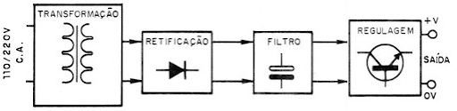

### Parte da Entrada da Fonte: Tensão A/C

Especificações da Tensão A/C no circuito:
- Voltagem de pico: 
Vpico = RMS * √2

Frequência e Deslocamento de Fase:
- Ambos os valores são tabelados, em São Paulo são 60Hz e 120°, que é a tensão referência para a elaboração deste trabalho.

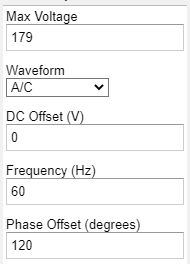

### Parte do Transformador (Transformer)
- **Finalidade**: o componente “transformador” realiza a modificação da tensão de entrada por outra previamente calculada (seja sentido direto ou indireto); ou seja, para o presente trabalho, reduz a tensão de entrada (127V) para uma menor (aproximadamente 18V).

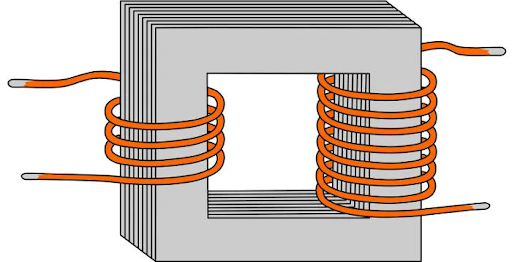 

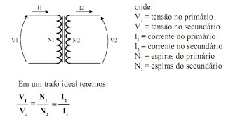

### Parte do Transformador (Transformer) - Cálculos

- A transformação de tensão no transformador acontece por meio eletromagnético, sendo certo que, em razão dos materiais usados na sua produção (liga de aço-silício), não apresenta dados significativas perdas de energia (por efeito Joule ou por correntes parasitas).
- Como desejamos diminuir o valor da tensão, foi preciso calcular a razão entre a tensão de saída (18.8V) pela tensão de entrada (179V) de modo a escolher o transformador adequado.
- Esclareça-se que o valor de tensão de entrada foi calculado no passo anterior, enquanto que o valor de saída foi superior a 12V porque há outros componentes na fonte que consomem voltagem, além da saída. 
Assim, temos que a razão entre os inputs do transformador é:

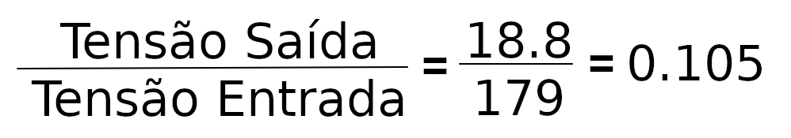

### Parte do Retificador de Onda Completa (Rectifier)
- **Finalidade**: a porção “retificadora de onda completa” recebe a tensão alternada proveniente do transformador e a modifica em onda pulsante unidirecional dentro do circuito eletrônico (isto é, com ripple). Esse passo é realizado pela ponte de diodo, que coordena a entrada de corrente no circuito. 

Antes da retificação:

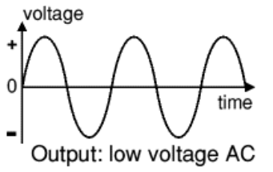

Depois da retificação:	

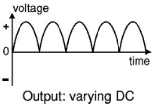

Representação da ponte de diodo:

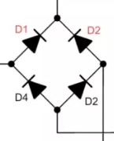

### Parte do Retificador (Rectifier) - Cálculos
- Na porção retificadora, teremos uma alternância de corrente elétrica alternada na ponte de diodos, o que faz a ativação de dois diodos por vez (ligados em série). 
- Assim, os valores das resistências serão somados e irão gerar uma perda aproximada de 0.7V por cada um. Logo, teremos um total de 1,4V dissipados.
- Tensão de ativação dos diodos: 
Va x Nd = 0.7V x 2 = **1,4V.**
**Va** = Voltagem de ativação dos diodos
**Nd** = Número de diodos

### Parte da Filtragem (Smoothing)

- **Finalidade**: objetiva suavizar as pulsões da tensão. É realizada pela ação de um capacitor eletrolítico ligado em paralelo com a fonte supridora de energia. Após carregado por completo (com a voltagem máxima), ele supre momentaneamente o circuito com corrente elétrica quando a onda reflete a diminuição na voltagem de entrada.

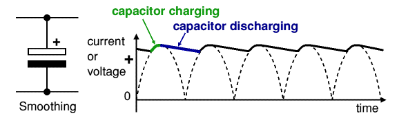

### Parte da Filtragem (Smoothing) - Cálculos

- Na porção de filtragem, foi necessário realizar os cálculos referentes ao capacitor que deveríamos utilizar para “linearizar” o ripple. 
- Utilizamos a fórmula para um ripple de 10%:

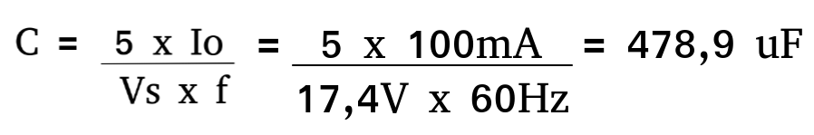
	
- C = Capacitância do Capacitor (F)
	Io = Corrente de Saída (A)
	Vs = Voltagem de Chegada (V)
	f = Frequência (Hz)

- Observação: no circuito eletrônico, optamos por um valor maior do que o calculado para garantir o suprimento necessário de corrente elétrica quando o pulso diminui sua voltagem e por ser mais comum no mercado.

### Parte da Regulagem (Regulator)

- **Finalidade**: recebe a corrente retificada bem como suaviza e modela a tensão de saída mantendo-a estável, embora haja variações na corrente elétrica. 
- É a porção mais complexa do circuito, englobando como componentes principais um potenciômetro, um diodo zener e um transistor.

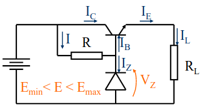 

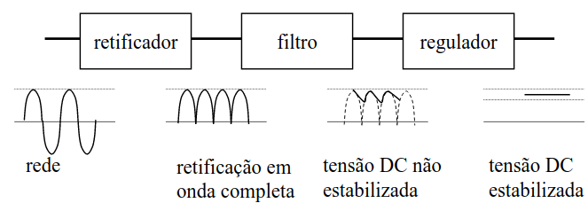

## Circuito no Falstad

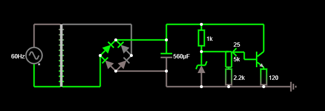

[Clique aqui para abrir](https://www.falstad.com/circuit/circuitjs.html?ctz=CQAgzCAMB0l3BWEDoBYEE4AcBGBcwwdVUAmVEANkmRFQgQFMBaHHAKADdwxKQsahPqUhYoIHFRo4A7BnGlYGehgQ5IpMBiKqIMBOwDuPPgPCUxZyEZMgRY3mPtR2AFXOWaqHMNHiKMOpIzDCQmKhhMqgyCEQ4mspIWNCUMryyYHJYWBFgTKxiMBjFNt6+YtGkdn7WxpXVFTJVxAHsACZ0TRIkyJAUbFVVbYwAZgCGAK4ANgAu7ci83RT4-fF2IMPj03MdKxIyfPUt65uTs-N7snyxfMdDo2dzxjdLC6Y0tW-8Xj7fLs99CRrahiAb-Xr9A5SUFQ6wAY2hQKqIP2fA+sEQt0o0Aw6nQRFIAlkAhkUAxHGMKLBKKsNipUJRzk+jL8FhoTPYYAoAC9GAA7RgAJ1Yegk0BkxDyhJwGGl8FILFJ7IkenY3KoZmcbJVwhAvIFwpwYDpZjMNI+7EFGpoZrMRrREngJukizSt0W1lkFDdOpAB1BFgkvTgZMQIAASowAM4ASyjMzGfLhjEtfsWPjEPqZdhEnyzrM1NRs+c8TiLMz9gbwVQEoIQVWkIGYqFgOCwCCa2kouMopAb4uIchkWG0xGKUsdNFO21TtYkgbn2finzn9u+nnBc9tNotAHN1w1+JQKNnrAB7Oyk4-+SDFapkhvrUik41AA)

## Circuito no EAGLE

Para construção do board PCB foi primeiro esquematizado o circuito com componentes no Eagle, em seguida gerado o board e organizado os componentes:

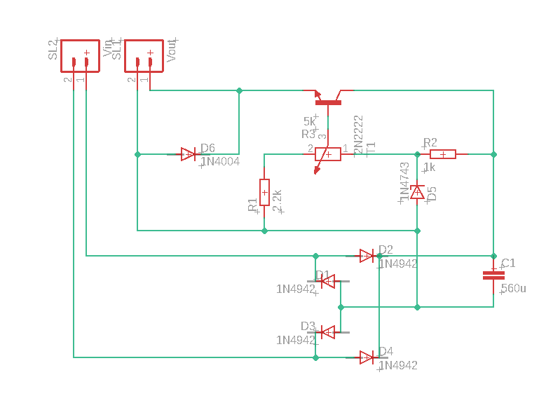

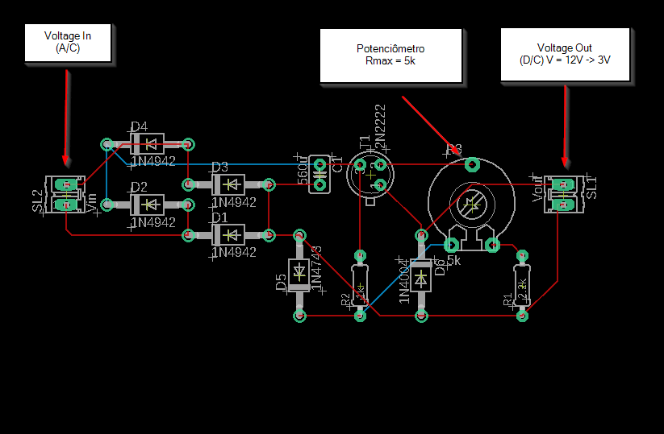

## Preço das Peças

| Componente | Especificação | Quantidade | Função | Preço (unidade) |
| ------ | ------ | ------ | ------ | ------ |
| [Transformador]() | 18V e 500mA | 1 | Reduz a tensão de entrada | R$ 27,99 |
| [Diodo]() | 600V e 1A | 4 | Retifica a tensão | R$ 0.19 |
| [Capacitor]() | 560μF | 1 | Reduz a tensão à um ripple específico | R$ 1.99 |
| [Diodo Zener]() | 13V e 0.5W | 1 | Linearizar o ripple | R$ 0.19 |
| [Transistor]() | 1A | 1 | Regula a tensão máxima de saída | R$ 0.29 |
| [Potenciômetro]() | 5KΩ | 1 | Regula a corrente para ativação do transistor | R$ 2.21 |
| [Resistor]() | 1KΩ | 1 | Limita e proteje a corrente no diodo zener | R$ 0.05 |
| [Resistor]() | 2.2KΩ | 1 | Compete com a corrente mínima, especificando a tensão de saída mínima | R$ 0.05 |
**Total: R$ 32.96**

